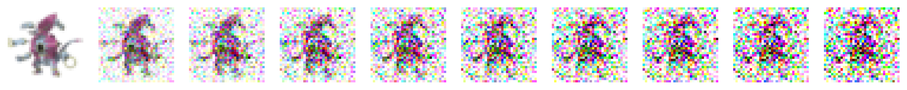

# Pokemon Diffusion: DDPM Implementation Lab



This repository contains the notebook for the 2026–2027 Advanced Communications and Signal Processing Laboratory @ Imperial College London. The exercise guides students through an end-to-end denoising diffusion probabilistic model (DDPM) for unconditional Pokemon image generation. The main exercise is in [Practical_Project.ipynb](Practical_Project.ipynb) [](https://colab.research.google.com/github/guyuxuan9/Diffusion_Experiments_Advanced_CSP_Lab_EEE_Imperial/blob/main/Practical_Project.ipynb).

## Exercise overview

You will implement and evaluate the main components of a DDPM:

1. Construct a linear variance schedule.
2. Sample a noisy state directly from a clean image using closed-form forward process.
3. Train a time-conditioned network to predict the added noise.
4. Implement one reverse diffusion transition.
5. Generate and visualize a complete reverse trajectory.
6. Design and evaluate an improved denoising architecture.

## Logistics

- Work in pairs. If needed, a group of three students will be created.
- Submit your results through Canvas.
- Plagiarism is not allowed and may lead to serious consequences. You may discuss approaches with classmates and take inspiration from open-source implementations.
- Small copied code snippets are allowed when their sources are clearly referenced.
- Python and PyTorch are recommended.
- Your code should run on Google Colab and a normal desktop computer with minimal setup effort.

## Setup

Open `Practical_Project.ipynb` in Jupyter or Google Colab and run the cells in order. A GPU is recommended for training but is not required for the initial implementation and checks.

For a local Jupyter environment, install the dependencies with:

```bash
python -m pip install -r requirements.txt
```

The notebook uses the following Python packages:

```text
numpy
Pillow
matplotlib
seaborn
imageio
torch
torchvision
```

## Assessed implementation tasks

Cells marked `TODO` contain the assessed work:

- **TODO 1-2:** Implement closed-form forward diffusion in `q_sample`.
- **TODO 3-5:** Sample training timesteps, create noisy inputs, predict noise, and compute the mean-squared-error loss.
- **TODO 6-7:** Implement the DDPM reverse-process mean and stochastic reverse update.
- **TODO 8-9:** Implement an improved time-conditioned denoiser with at least two meaningful architectural changes.

The cosine schedule is an optional extension.

Training is deliberately opt-in. Complete and test the forward process and loss before changing:

```python
RUN_TRAINING = False
```

to `True`. The starter configuration uses 20 training epochs so that the complete pipeline can be tested before running longer experiments.

## Requirements for completion

To complete the exercise:

- Implement technically correct forward and reverse diffusion processes.
- Run the supplied shape and finite-value checks.
- Train the noise-prediction model and save the final checkpoint.
- Create animations of the forward and reverse processes.
- Show that the terminal forward distribution approaches a standard Gaussian distribution.
- Implement at least two meaningful improvements to `TinyDenoiser`.
- In the formal report, draw an architectural diagram showing data flow, time conditioning, resolution changes, skip connections, and main tensor shapes.
- Compare the baseline and improved models using parameter counts, training-loss curves, and equally sized generated-image grids under the same sampling settings.
- Answer all six questions at the end of the notebook.
- Use clear variable names, comments, and fixed random seeds.

For a fair architecture comparison, keep the dataset, diffusion schedule, optimizer, number of training updates, random seed, and sampling procedure fixed.

## Generated files

Running the starter cells creates or overwrites these exploratory files:

| File | Contents |
| --- | --- |
| `dataset_summary.png` | Original and augmented dataset examples |
| `color_distribution_original_images.png` | RGB-value distributions before diffusion |
| `forward_animate.gif` | Animation of the intentionally incorrect warm-up process |
| `forward_grid.png` | Image grid from the intentionally incorrect warm-up process |

After the corresponding TODOs are complete and the visualization calls are enabled, the DDPM section uses these filenames:

| File | Contents |
| --- | --- |
| `forward_process_student.png` | Forward diffusion trajectory |
| `forward_process_student.gif` | Forward diffusion animation |
| `pokemon_ddpm_student.pt` | Model state, optimizer state, loss history, and diffusion-step configuration |
| `reverse_process_student.png` | Reverse diffusion trajectory |
| `reverse_process_student.gif` | Reverse diffusion animation |

## Suggested submission checklist

- Completed `Practical_Project.ipynb`, including outputs and written answers
- Final model checkpoint
- Forward-process image and GIF
- Reverse-process image and GIF
- Terminal channel-distribution plot
- Improved-model architecture diagram
- Baseline-versus-improved loss comparison
- Baseline-versus-improved generated-image comparison

## Passing criteria

Image quality is not the main grading criterion. A passing submission should demonstrate a technically correct forward and reverse process, reproducible execution, saved model weights, forward and reverse animations, and evidence that the terminal forward distribution approaches a standard Gaussian distribution.

## Bonus directions

Possible extensions include:

- Conditioning generation on a Pokemon label or type, such as Fire
- Replacing the linear variance schedule with a cosine schedule
- Exploring stronger time embeddings or attention-based denoiser
- Using latent diffusion instead of diffusion in RGB image space

## Acknowledgements

This repository is adapted from:

- [diffusion_experiments_imperial_college_london](https://github.com/EliGE6922/diffusion_experiments_imperial_college_london)
- [pokemon_diffusion](https://github.com/gerritgr/pokemon_diffusion)

## References

### Preliminaries

- [10 tricks for a better Google Colab experience](https://towardsdatascience.com/10-tips-for-a-better-google-colab-experience-33f8fe721b82)
- [Deep Learning With PyTorch, full course](https://www.youtube.com/watch?v=c36lUUr864M&ab_channel=PatrickLoeber)
- [UvA PyTorch tutorial](https://uvadlc-notebooks.readthedocs.io/en/latest/tutorial_notebooks/tutorial2/Introduction_to_PyTorch.html)
- [U-Net: Convolutional Networks for Biomedical Image Segmentation](https://link.springer.com/content/pdf/10.1007/978-3-319-24574-4_28.pdf)

### Diffusion models

- [What are Diffusion Models?](https://www.youtube.com/watch?v=fbLgFrlTnGU)
- [Tiny Diffusion](https://github.com/tanelp/tiny-diffusion)
- [Diffusion models from scratch in PyTorch](https://www.youtube.com/watch?v=a4Yfz2FxXiY&t=644s)
- [Diffusion Models: PyTorch Implementation](https://www.youtube.com/watch?v=TBCRlnwJtZU&ab_channel=Outlier)
- [The Annotated Diffusion Model](https://huggingface.co/blog/annotated-diffusion)
- [Diffusion models explained at four levels](https://www.youtube.com/watch?v=yTAMrHVG1ew)
- [How AI Image Generators Work](https://www.youtube.com/watch?v=1CIpzeNxIhU)

### Pokemon data and generation

- [Pokemon Images Dataset on Kaggle](https://www.kaggle.com/datasets/kvpratama/pokemon-images-dataset)
- [PokeGAN](https://blog.jovian.com/pokegan-generating-fake-pokemon-with-a-generative-adversarial-network-f540db81548d)
- [pokemon-ga](https://github.com/Zhenye-Na/pokemon-gan)
