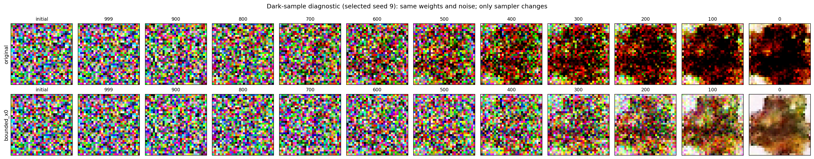

# 去噪问题检查结果

已用现有 `pokemon_ddpm_student.pt` 重现与附件相似的逐渐发黑现象。主要证据指向：模型噪声预测存在偏差，未经约束的反向采样会随随机初值出现数值漂移，显示函数再将越界值截断成黑色或白色。核心 DDPM 公式没有发现写错。

## 证据

- `q_sample`、epsilon MSE、`p_sample` 均值、后验标准差及最后一步不加噪均通过数学检查。Oracle 使用已知干净图像计算真实噪声，对照独立后验公式，测试 t=0/1/500/999；用 float64 排除小 t 的浮点抵消误差。
- 权重确实包含100轮训练，loss从0.673173降至0.049650。采样没有重新训练。
- GPU单图检查了seed=0至11，挑出这组中最暗的seed=9做对照（不是总体失败率估计）。原采样结果范围 **[-4.928, 2.248]**，**63.83%通道值低于-1**，**32.71%像素的三个通道都不高于-1**，显示成纯黑。某些其他seed则过亮；例如seed=10有99.12%通道值高于1。
- `tensor_to_img` 中 `(tensor + 1) / 2` 后的clamp逻辑本身正确；它把反向链的越界问题表现为黑/白区域，修改显示范围不能修复采样分布。
- 同一权重、同一seed=9、同一初始噪声和每步噪声，只改用预测干净图像截断的采样器后，背景与轮廓恢复，纯黑像素比例降至0。但图像仍模糊，不能据此认为模型已经充分学好。
- 前16张训练图的诊断中，t=999时噪声预测的RGB平均误差约为[-0.0514,-0.0005,+0.0636]，与生成时红偏高、蓝偏低方向吻合。这是小样本训练集诊断，不是泛化评估。



上排为原采样，下排为截断预测干净图像后的采样。该图重现同类故障，不是附件原始随机状态的逐像素复现。

## 建议的最小修正

在notebook第5节 `p_sample` 中，保留噪声预测和后验噪声项，将 `model_mean = ...` 替换为下列计算，并在最后一步直接返回 `predicted_x0`：

```python
alpha_bar_prev_t = extract(schedule["alpha_bars_prev"], timesteps, x_t.shape)
predicted_x0 = (
    x_t - torch.sqrt(1.0 - alpha_bar_t) * predicted_noise
) / torch.sqrt(alpha_bar_t)
predicted_x0 = predicted_x0.clamp(-1.0, 1.0)

if step == 0:
    return predicted_x0

model_mean = (
    beta_t * torch.sqrt(alpha_bar_prev_t) / (1.0 - alpha_bar_t) * predicted_x0
    + torch.sqrt(alpha_t) * (1.0 - alpha_bar_prev_t)
      / (1.0 - alpha_bar_t) * x_t
)
```

限制的是预测的干净图像，不是仍含高斯噪声的 `x_t`。完整已运行的候选函数见 `check_denoising.py` 中的 `p_sample_clipped`。这与 [OpenAI improved-diffusion 官方实现](https://github.com/openai/improved-diffusion/blob/main/improved_diffusion/gaussian_diffusion.py) 的默认 `clip_denoised` 策略一致。范围回到[-1,1]是算法保证；实际改善依据是同噪声对照图，不是仅看越界率归零。

先用原权重验证这一采样改动，无须为这一步重新训练。采样端稳定化后，再评估噪声预测偏差和模型质量。

## 另外两个检查项

1. 数据集对已经归一化到[-1,1]的tensor调用 `RandomAutocontrast(p=0.1)`。当前torchvision实测将[-1,0,1]变为[0,0.5,1]，改变了部分样本的归一化范围。应在[0,1]上做颜色增强，最后再统一映射至[-1,1]。调整训练数据后需要另行训练/微调并比较；这个问题不能单独认定为黑图原因。参见 [torchvision v0.15.2源码](https://raw.githubusercontent.com/pytorch/vision/v0.15.2/torchvision/transforms/_functional_tensor.py)。
2. `sample_images`直接使用内存中的`model`，不主动加载checkpoint。重启kernel或重新运行建模单元后，应明确加载权重再采样。保存的执行顺序及本次加载现有权重的复现不支持把“忘记训练”认定为本次原因。

## GPU与验证范围

本机为torch 2.0.1+cu118、RTX 5060，确实出现sm_120兼容性警告。不过在相同输入下，CPU/GPU模型预测最大绝对差异约1.51e-5，GPU也成功完成完整反向链。这些检查不支持将该警告认定为本次黑图的直接原因，也不代表对整个环境的兼容性保证。

所有新输出写在本目录，原notebook、模型权重和原始PNG/GIF未改动。权重SHA256已与诊断开始时记录核对一致。

- `denoising_metrics.json`：CPU四图对照与已知前向噪声测试。
- `dark_sample_metrics.json`：GPU十二seed的结果及seed=9对照。
- `device_consistency.json`：相同输入的CPU/GPU预测比较。
- `gpu_single_metrics.json`：GPU seed=42单图对照。
- `check_*.py`：可复运行脚本，均只推理，不执行notebook的安装、下载或训练单元。
